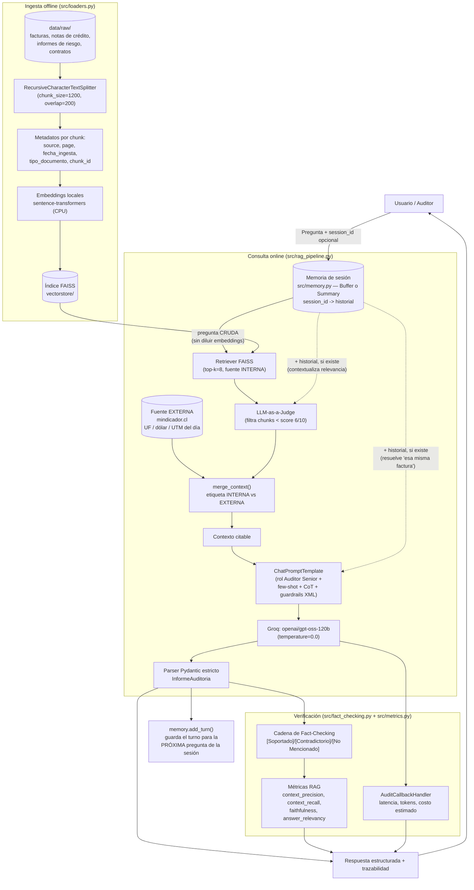

# Arquitectura de la solución — Agente RAG de Auditoría Financiera (EP1 - ISY0101)

## Diagrama de flujo (Mermaid)

Imagen renderizada: [`docs/architecture.png`](architecture.png). Fuente
editable: [`docs/architecture.mmd`](architecture.mmd) (regenerar con
`npx -p @mermaid-js/mermaid-cli mmdc -i docs/architecture.mmd -o docs/architecture.png -b white -s 2`).

## Componentes clave

| Componente | Módulo | Responsabilidad |
|---|---|---|
| Ingesta y chunking (fuente INTERNA) | `src/loaders.py` | Carga PDF/TXT, fragmenta sin cortar tablas financieras, adjunta metadatos de trazabilidad, construye/persiste FAISS. |
| Fuente EXTERNA | `src/external_data.py` | Consulta la API pública `mindicador.cl` (UF, dólar, UTM del día); degrada con gracia si falla (timeout, caída, respuesta malformada) sin tumbar el pipeline. |
| Configuración y proveedores | `src/config.py` | Único punto de conexión a LLM (Groq por defecto; Google AI Studio/Gemini y GitHub Models disponibles como alternativa) y a embeddings (local vía sentence-transformers por defecto; Google/GitHub como alternativa), parámetros centrales. |
| Prompts | `src/prompts.py` | Rol experto, few-shot con delimitadores, Chain-of-Thought explícito, guardrails XML anti-alucinación, instrucciones de cuándo usar la fuente externa. |
| Orquestación RAG | `src/rag_pipeline.py` | Ensambla `retriever \| LLM-judge \| merge_context (interna+externa) \| prompt \| model \| parser` vía LCEL; expone `AuditRagPipeline`. |
| Memoria conversacional | `src/memory.py` | `BufferMemory` (historial completo) y `SummaryMemory` (resumen progresivo, +1 llamada LLM por turno) intercambiables por `MEMORY_STRATEGY`; una instancia por `session_id`, en memoria del proceso. Comparación empírica en `docs/comparacion_memoria.md`. |
| Verificación fáctica | `src/fact_checking.py` | Segunda cadena LLM que clasifica cada afirmación de la respuesta contra el contexto. |
| Observabilidad y métricas | `src/metrics.py` | `AuditCallbackHandler` (latencia/tokens/costo) + las 4 métricas RAG deterministas + esquemas Pydantic. |

## Justificación de decisiones (resumen; ver informe técnico para el detalle completo)

- **LLM-as-a-judge antes del generador**: en auditoría, un chunk irrelevante que "contamina" el contexto puede inducir al modelo a mezclar cifras de documentos distintos. Se prioriza precisión sobre recall.
- **Salida Pydantic estricta**: permite validar programáticamente cada respuesta (tipos, campos obligatorios) antes de que llegue a un sistema downstream de cumplimiento.
- **Fact-checking como cadena separada**: reduce el riesgo de que el mismo sesgo de la generación contamine su propia verificación.
- **`temperature=0.0`**: en un dominio donde un monto o RUT mal citado tiene implicancias regulatorias, se prioriza determinismo sobre creatividad.
- **Fuente externa etiquetada y degradable (`mindicador.cl`)**: se eligió una API pública real (no un mock permanente) para que el requisito de "fuente interna + externa" sea verificable en producción, no solo en un diagrama. Se etiqueta explícitamente en el contexto (`[FUENTE EXTERNA: ...]` vs `[fuente=archivo | chunk_id=N]`) para mantener la trazabilidad de cada dato, y se diseñó para degradar con gracia: una API externa no crítica nunca debe tumbar una consulta de auditoría (ver `docs/evidencia_pruebas.md` para un caso real de esta falla y recuperación).
- **Historial conversacional inyectado como texto, no como retriever reformulado**: para resolver preguntas de seguimiento ("esa misma factura") se evaluaron el patrón "history-aware retriever" (una llamada LLM extra que reformula la pregunta antes de la recuperación) y la inyección directa del historial en el prompt. Se eligió la segunda por ser más simple y confiable dados los guardrails anti-alucinación ya estrictos: cero llamadas LLM adicionales para la reformulación, cero riesgo de que esa reformulación invente un documento que no existe. El historial contextualiza al JUEZ y al GENERADOR (ambos basados en LLM, robustos a texto extra), pero NO al RETRIEVER (embeddings), para no diluir el vector de búsqueda con texto de turnos anteriores.
- **BufferMemory como estrategia por defecto**: ver comparación empírica completa en `docs/comparacion_memoria.md`. Resultado real (5 turnos contra Groq): ambas estrategias respondieron el dato de seguimiento correctamente (sin degradación observada), pero `summary` costó 16,2% más y usó 5 llamadas extra a la API — la llamada adicional de actualización del resumen supera, a esta escala, el ahorro de tokens que logra comprimir el historial (el bloque de contexto RAG que se reenvía cada turno domina el tamaño del prompt, no el historial). `summary` seguiría siendo la elección correcta para sesiones de decenas de turnos, donde el crecimiento sin límite del buffer se vuelve el problema dominante.
