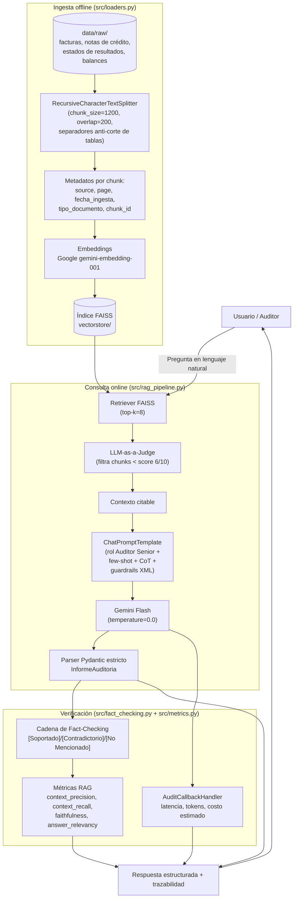

# Arquitectura de la solución — Agente RAG de Auditoría Financiera (EP1 - ISY0101)

## Diagrama de flujo (Mermaid)

## Componentes clave

| Componente | Módulo | Responsabilidad |
|---|---|---|
| Ingesta y chunking | `src/loaders.py` | Carga PDF/TXT, fragmenta sin cortar tablas financieras, adjunta metadatos de trazabilidad, construye/persiste FAISS. |
| Configuración y proveedor LLM | `src/config.py` | Único punto de conexión a Google AI Studio/Gemini (o GitHub Models como alternativa), parámetros centrales. |
| Prompts | `src/prompts.py` | Rol experto, few-shot con delimitadores, Chain-of-Thought explícito, guardrails XML anti-alucinación. |
| Orquestación RAG | `src/rag_pipeline.py` | Ensambla `retriever \| LLM-judge \| prompt \| model \| parser` vía LCEL; expone `AuditRagPipeline`. |
| Verificación fáctica | `src/fact_checking.py` | Segunda cadena LLM que clasifica cada afirmación de la respuesta contra el contexto. |
| Observabilidad y métricas | `src/metrics.py` | `AuditCallbackHandler` (latencia/tokens/costo) + las 4 métricas RAG deterministas + esquemas Pydantic. |

## Justificación de decisiones (resumen; ver informe técnico para el detalle completo)

- **LLM-as-a-judge antes del generador**: en auditoría, un chunk irrelevante que "contamina" el contexto puede inducir al modelo a mezclar cifras de documentos distintos. Se prioriza precisión sobre recall.
- **Salida Pydantic estricta**: permite validar programáticamente cada respuesta (tipos, campos obligatorios) antes de que llegue a un sistema downstream de cumplimiento.
- **Fact-checking como cadena separada**: reduce el riesgo de que el mismo sesgo de la generación contamine su propia verificación.
- **`temperature=0.0`**: en un dominio donde un monto o RUT mal citado tiene implicancias regulatorias, se prioriza determinismo sobre creatividad.
